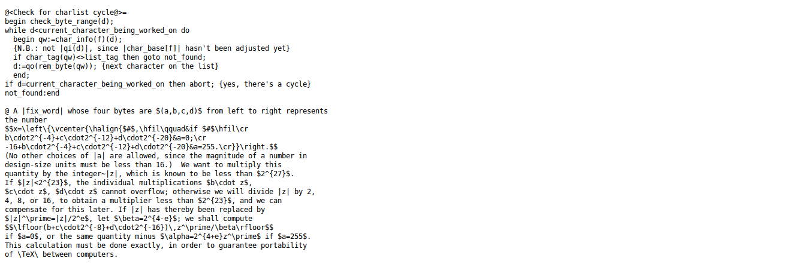
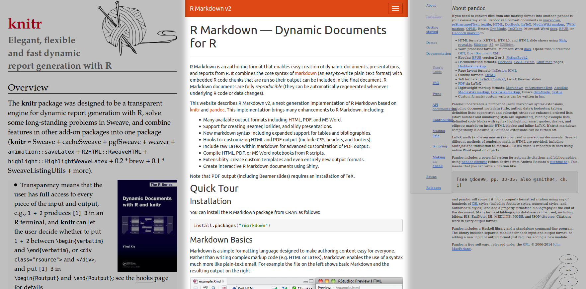

# Introducción

## Investigación + Programación

### Ciencia reproducible

"En el *dataset* `iris`, podemos ver la relación entre el tamaño
del pétalo y su especie:"

```{r, echo=F, fig.height=5}
data(iris)
plot(Petal.Width ~ Petal.Length, data = iris, col = iris$Species)
```

---------------

### Programación literaria

"Cargamos el *dataset* `iris`."
```R
data(iris)
```

"Vamos a representar la longitud del pétalo según
su ancho, y colorearemos según la especie."
```R
plot(Petal.Width ~ Petal.Length, data = iris, 
  col = iris$Species)
```

--------------

> Instead of imagining that our main task is to instruct a computer what to do, let us concentrate rather on **explaining to humans** what we want the computer to do. 

> -- Donald E. Knuth, Literate Programming, 1984

## Los inicios

### WEB

* Escrito por **Donald E. Knuth** para \TeX

* Genera Pascal compilable

* CWEB genera C

* *TeX: The program*

. . .



### noweb

* Escrito por **Norman Ramsey**

* Genera ejecutables de **cualquier lenguaje**

* Permite \TeX, \LaTeX, HTML

## knitr

### knitr

* Programación literaria en R

* Archivos `.Rnw` con \LaTeX


# R Markdown

## 

### Variantes de Markdown

* [(PHP) Markdown Extra](https://michelf.ca/projects/php-markdown/extra/)
* Maruku, [Kramdown](http://kramdown.gettalong.org/)
* Pandoc Markdown
* ...

## ¿Qué es R Markdown?

### knitr + Pandoc Markdown



## Escribiendo R Markdown

### YAML

~~~
---
title: Ejemplo de R Markdown
author: Alice, Bob
output: 
  pdf_document:
    toc: yes
  html_document:
    toc: yes
---
~~~

### Chunks

\texttt{\`}\texttt{\`}\texttt{\`}\texttt{\{r, echo=FALSE, eval=TRUE\}}  
`plot(rnorm(20, mean = 10, sd = 3))`  
\texttt{\`}\texttt{\`}\texttt{\`}

```{r, echo=FALSE, eval=TRUE, fig.height=5}
plot(rnorm(20, mean = 10, sd = 3))
```

### Código en línea

R permite insertar valores en una frase:

\texttt{El número e vale \`}\texttt{r exp(1)}\texttt{\`}

El número e vale `r exp(1)`

### Ecuaciones

#### En línea

`Modo matemático en línea: $e^{i\tau} = 1$`  
Modo matemático en línea: $e^{i\tau} = 1$

. . .

#### En bloque

\columnsbegin

\column{0.5\textwidth}


```
$$D(x)= 
  \begin{cases}
    0 & x \in\mathbb Q\\
    1 & x \notin\mathbb Q
  \end{cases}$$
```

\column{0.5\textwidth}

$$D(x)= 
  \begin{cases}
    0 & x \in\mathbb Q\\
    1 & x \notin\mathbb Q
  \end{cases}$$
  
\columnsend

# Markdown y otros lenguajes

## Desde R Markdown

### R Markdown para todo

```{r test-ruby, engine='ruby'}
puts "Hello world, I'm Ruby #{RUBY_VERSION}!"
```

. . .

```{r test-py, engine='python'}
import platform
print("Hi! I'm Python " + platform.python_version())
```

. . .

```{r test-o, engine='node'}
console.log("And I'm Node " + process.versions.node);
```

## Otras herramientas

### Haskell: Pandoc

### Python: Pweave